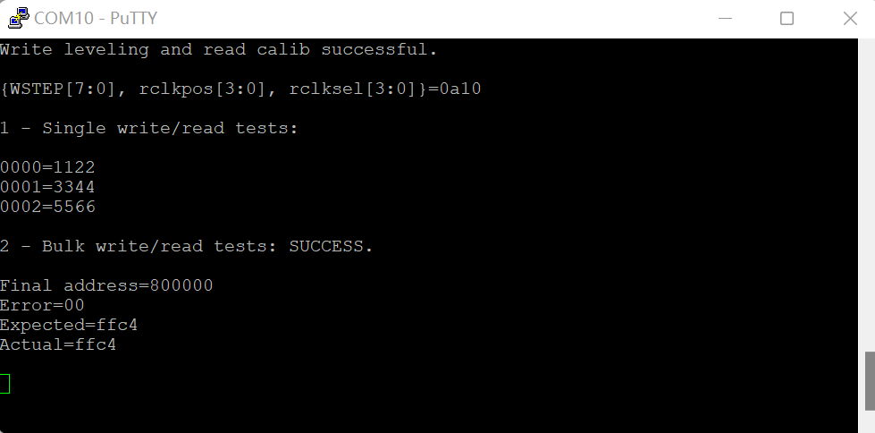

# Simple low-latency DDR3 PHY controller for Tang Primer 20K

This is a DDR3 controller for GW2A / Tang Primer 20K. Most memory functions are implemented. But there are still metastability in the calibration process and maybe other places. So consider this highly EXPERIMENTAL.

Unlike more portable designs, we use Gowin OSER8_MEM/DQS primitives for running at higher speeds (DDR3-800). We are aiming mostly at low-latency use cases like emulators (initially written for [NESTang](https://github.com/nand2mario/nestang)). The achieved read latency is about 90ns. The interface is single 16-bit word based and uses no bursting. For more predictable behavior, the controller also exposes a *refresh* input for executing auto-refreshes, avoiding the longer latencies introduced by controller-initiated refreshes. Resource usage is 1377 logic elements (6% on GW2A-18C).

DDR3 requires a fair amount of setting-ups to function properly. In particular, it needs dynamic adjustments to clock timings to make reads/writes more stable. Here are the implemented mechanisms: ZQ calibration, writing leveling, read calibration and dynamic ODT. 

The official documentation from Gowin is quite lacking for DDR-related primitives like DQS, IDES8_MEM and OSER8_MEM. The dev process thus involved quite some trial-and-errors and cross-checking with other vendors' docs. So the code also serves as examples/documentation for these constructs.

Test screenshot:

There's also an iverilog and gtkwave-based simulation. If you are interested in all the signaling/timing details about DDR3. See [simulation instructions](iverilog/README.md).

Build instructions,
* Gowin IDE 1.8.0.7
* Project->Configuration->Synthesis: set Verilog language to SystemVerilog 
* Project->Configuration->Dual Purpose Pin: Use SSPI as regular IO

nand2mario, 2022.9
