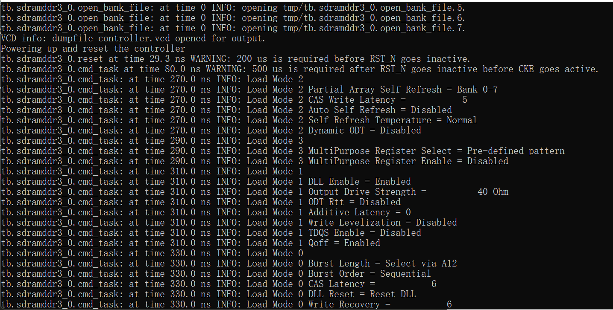
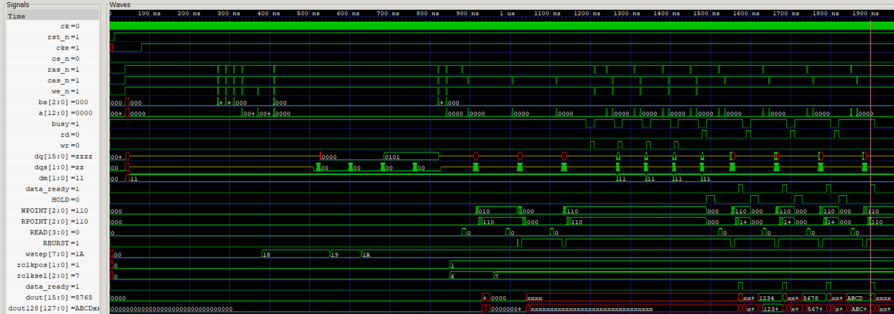

## Simulation setup using Icarus Verilog, prim_sim.v and Micro DDR3 model

The Gowin IDE doesn't come with integrated model simulation as of late 2022. Luckily they do provide behavioral HDL for their primitives. So combining that with a DDR3 memory model, we can simulate our design with iverilog.

What you need (on Windows).

* [Icarus Verilog 11](https://bleyer.org/icarus/iverilog-v11-20201123-x64_setup.exe). This particular version works for me. The latest version has some issues (assertion errors) with the Micron DDR3 model.
* Micron DDR3 memory model. Get it from [Micron's website](https://www.micron.com/products/dram/ddr3-sdram) ("DDR3 SDRAM Verilog Model, version 1.74"). Extract the source files to this dir.
* Gowin's `prim_sim.v`. It comes with Gowin IDE: for example `Gowin_V1.9.8.07/IDE/simlib/gw2a/prim_sim.v`.
* GNU make: `choco install make`

Then you can run 
```bash
make run.controller
```

It gives a detailed view of what's happening, including timing errors. This is essential for debugging the controller.



With gtkwave, you can view the wavefrom:



